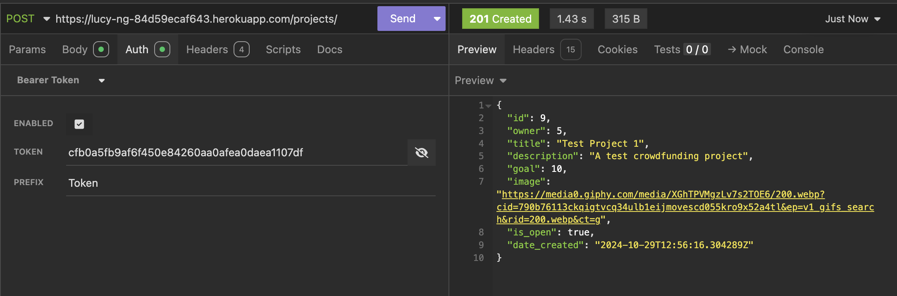

# Crowdfunding Back End
Lucy Nguyen - Link to project: https://lucy-ng-84d59ecaf643.herokuapp.com/

## Planning:
### Concept/Name: Atleticlub
This is a website to raise funds for Atleticlub, an initiative hosted by Atletico Saigon to provide soccer training sessions and life skills to vulnerable Vietnamese children in underprivileged areas of Saigon. Users can go on the website to make pledges to support specific training sessions by Atletico with funds, sponsorship or partnership.

### Intended Audience/User Stories
Donors(Users): Individuals/ Local Businesses/ Soccer Teams interested in supporting training sessions.
    - As a donor, I want to easily navigate the website to view different projects and pledge funds to the project(s) that most resonate with me
    - As a donor, I want to contact Atletico Saigon to explore potential partnerships and sponsorships
    - As a donor, I want to create an account to make a donation securely, track my pledges and see how close a project is to reaching its goals
    - As a donor, I want to receive updates about the projects I have supported 
    - As a donor, I want to modify or delete my pledges if I want to

Admin (Atletico Team): Managing the website
    - As an admin, I want to create and manage projects, set fundraising goals, and track progress
    - As an admin, I want to view and manage users pledges
    - As an admin, I want to be able to review and approve changes to a pledge made by users, including creating a pledge, modify and delete it.

Beneficiaries (kids): Children to will receive the trainings
    - As kid, I want to view the upcoming activities, training sessions
    - As kid, I want to view those who have supported me
    - AS kid, I want to view that the sponsorships are (new shoes, food, sport clothes,...)

### Front End Pages/Functionality
- Homepage
    - Displays a photo of Atletico tean in the background with the mission content text
    - Displays all active projects with current pledge amounts and progress towards goals
    - Easy access to create an account or login as a donor
- Project Details Page
    - Detailed view of each project, including goals, milestones, and funding progress
    - Option to pledge specific amounts or custom donations
    - Show list/number of donors (if they choose to be visible - if a donor is invisible, they will still show as a donor but with a quote saying 'this donor has chosen to be anonymous) and their pledge amounts/ sponsorship
- User Dashboard 
    - Admin can create, update, or delete projects, set goals, and track progress
    - View and manage user pledges and overall project success
- Kid section 
    - Display upcoming soccer activities and training sessions
    - Show a list of donors who have supported the program

### API Spec
{{ Fill out the table below to define your endpoints. An example of what this might look like is shown at the bottom of the page. 

It might look messy here in the PDF, but once it's rendered it looks very neat! 

It can be helpful to keep the markdown preview open in VS Code so that you can see what you're typing more easily. }}

##Note: I have added strike-through lines across API specs that I have failed to set up - I will keep it as is for now to come back later to fine tune - sorry for the messy look!

| URL             | HTTP Method |Purpose  | Request Body | Success Response Code | Authentication/Authorisation |
| ---             | ----------- | ------- | ------------ | --------------------- | ---------------------------- |
| /project/       | GET | Retrieve all active project ||  200  |None|
| /projects/{id}  | GET | Retrieve project by ID ||  200  | None |
| /projects/      | POST | Create a new project     |"name","date", "goal", "description"|  201  | Admin Auth |
| /projects/{id}  | PUT  | Update project details   |"name","date", "goal", "description"|  200  | Admin Auth |
| /projects/{id}  | DELETE | Delete a project       |                                          |  204  | Admin Auth |
| ~~/projects/{id}/updates~~ | ~~GET~~ | ~~Retrieve project updates~~ ||~~200~~|~~User Auth~~ |
| /pledges/       | POST | Submit a pledge          |"amount": float, "project": ID|  201  | User Auth  |
| /pledges/{id}   | PUT | Modify a pledge          |"amount": float|  200  | User Auth  |
| /pledges/{id}   | DELETE | Delete a pledge          ||  204  |User Auth|
| /users/         | POST | Create a user account    |"name", "email", "password"|  201  | None       |
| /users/login    | POST | User login    |"email", "password"|  200  | None      |
| /users/logout   | POST | User logout   | |  200  | None      |
| /users/{id}     | GET  | Retrieve user details    | Retrieve user details                    |  200  | User Auth  |
| /users/{id}     | PUT  | Update user details      |"name", "email", "password"|  200  | User Auth  |
| /users/{id}     | DELETE | Delete user account    | "name", "email", "password"|  204  | User Auth  |
| ~~/admin/approvals/~~ | ~~GET~~ | ~~View pending pledge modifications~~ | |  ~~204~~  | ~~Admin Auth~~  |
| ~~/admin/approvals/{id}~~ | ~~PUT~~ | ~~Approve or reject pledge update~~ |~~"approval_status": "approved/rejected"~~| ~~200~~ |~~Admin Auth~~  |   
### DB Schema

### Screenshots in Insomnia 
1. GET method (projects)
 

2. POST method (pledges)
 

3. A TOKEN being returned
 

### Register a new user and create a new project 
1. Create New User
 

2. User login 
 

3. Create a project with user token
 
 